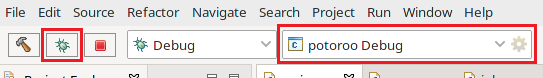

# build with eclipse

To begin building or debugging the output directories have to be created by right clicking on the potoroo project in the "Project Explorer" and select "Build Configurations > Build All".

## Launch Configurations

1. Select the desired Launch Configuration (Release or Debug)
0. Launch

